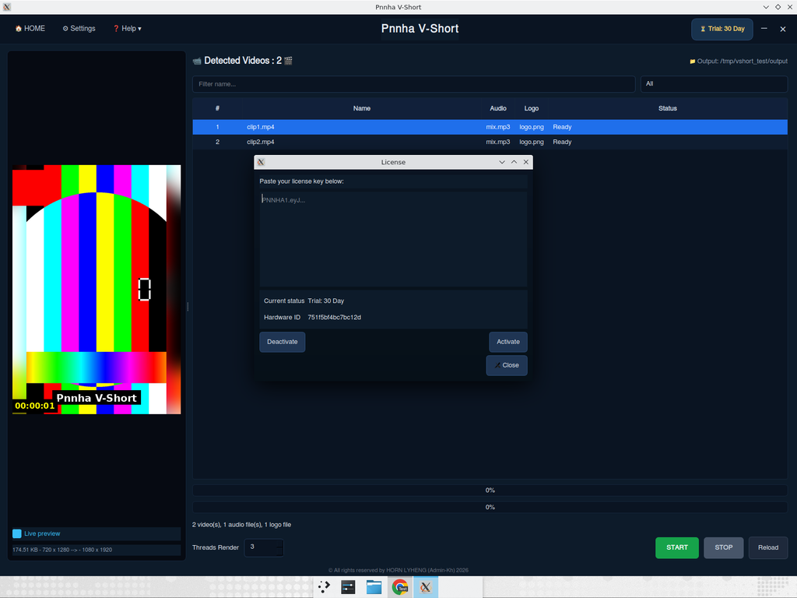
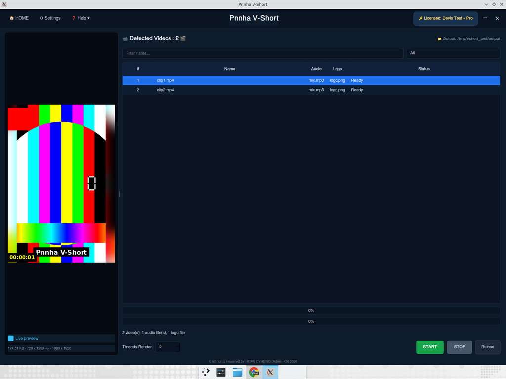

# Pnnha V-Short

A PyQt6 desktop application for batch video processing — built to mirror the
look-and-feel of V-Short 3.2 by HORN LYHENG (Admin-Kh).

> Looking for the full developer build-from-scratch guide? See
> [`docs/DEVELOPER_TUTORIAL.md`](docs/DEVELOPER_TUTORIAL.md) — a 28-section,
> ~2,900-line **bilingual** tutorial covering project setup, architecture
> diagrams, every module in lesson form (with exercises), the FFmpeg
> filter graph, PyInstaller packaging, license-key workflow,
> distribution, troubleshooting, and a KH ↔ EN glossary.

Features
--------
* Bilingual UI — English ↔ ខ្មែរ (toggle in **Settings**)
* Batch **Merge** of detected clips
* **Cut-plus** — split each clip into N equal parts
* **Rename-plus** — bulk rename with prefix + zero-padded index
* Add **Logo**, **Text** and **Timer** overlays
* **Live preview** (renders the first frame of the selected clip with effects applied)
* **Blur background** mode for vertical videos
* Audio modes — **Mix**, **Mute**, **Random**, **MP3** (replace with a folder of MP3s)
* Hardware acceleration — **Nvidia NVENC**, **AMD AMF**, or **CPU x264**
* **CPU limit** slider (caps the number of ffmpeg worker threads per job)
* **Threads Render** — process several clips in parallel
* 30-day **Free Trial** counter persisted to disk
* Real **Ed25519-signed license keys** for paying users — see [Licensing](#licensing)

Requirements
------------
* Python ≥ 3.10
* ffmpeg available on `PATH` (Windows: download from <https://www.gyan.dev/ffmpeg/builds/>
  and add the `bin` folder to `PATH`)
* `pip install -r requirements.txt`

Run
---
```bash
python main.py
```

Project layout
--------------
```
pnnha_vshort/
├── main.py                  # entry point
├── app/
│   ├── i18n/                # English + Khmer string tables
│   ├── core/                # ffmpeg pipeline, scanner, trial, hardware, licensing
│   └── ui/                  # styles, sidebar, table, preview, dialogs
├── tools/                   # admin-only: mint signed license keys
├── assets/                  # logo + icons
└── data/                    # settings.json / trial.json / license.json (runtime)
```

Licensing
---------
The app ships with a 30-day trial. After the trial expires, the user must paste
an **Ed25519-signed license key** that you mint with the admin CLI.

The verification is fully **offline** — the app embeds a public key and rejects
anything that isn't signed by your private key.

First-time admin setup (do this once when you take ownership of the project):

```bash
# replaces the development keypair with your own and patches the embedded
# public key inside app/core/licensing.py
python tools/generate_key.py --init --force
git add app/core/licensing.py keys/admin_public.txt
git commit -m "Rotate license signing keypair"
```

> The previous test key (and the key shown in `docs/screenshots/`) will stop
> validating after you rotate the keypair — which is the whole point.

Mint a key for a customer:

```bash
python tools/generate_key.py mint \
    --name "Sok Dara" --email dara@example.com \
    --type pro --max-machines 3
```

Mint a 1-year Standard key:

```bash
python tools/generate_key.py mint \
    --name "Lim Chenda" --email chenda@example.com \
    --type standard --expires 2027-05-22
```

The customer pastes the key into the **License** dialog (click the trial badge
in the app). On activation, the key is bound to that machine's hardware ID and
stored in `data/license.json`. See [`tools/README.md`](tools/README.md) for
the full admin workflow.




© All rights reserved by HORN LYHENG (Admin-Kh) 2026
